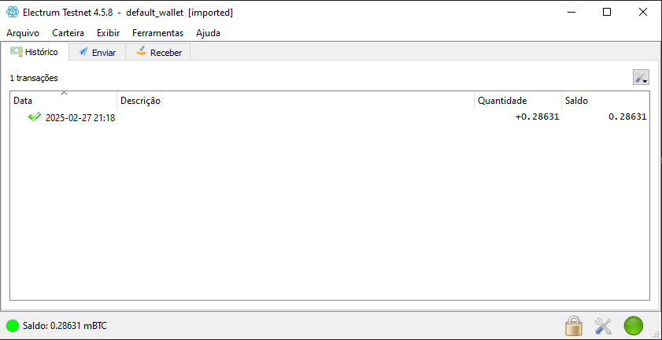

# Bitcoin Wallet Generator (Testnet & Mainnet)

## 📌 Project Overview
This project demonstrates how to create a **Bitcoin wallet** on the **Testnet** using **Node.js** and the `bitcoinjs-lib`, `bip32`, and `bip39` libraries. The goal is to generate a BTC wallet, understand the process for creating a wallet on the **Mainnet**, and learn how to send and receive transactions.

## 🎯 Objectives
- Generate a Bitcoin **Testnet** wallet using Node.js.
- Learn how to create a wallet on the **Mainnet**.
- Use **Electrum Wallet** to manage Testnet funds.
- Use a **Testnet BTC faucet** to receive Testnet BTC.
- Send and receive Bitcoin transactions on the Testnet.

## 🛠️ Technologies Used
- **Node.js**
- **bitcoinjs-lib** (Bitcoin library for JavaScript)
- **bip32** (Hierarchical Deterministic wallet management)
- **bip39** (Mnemonic phrase generation)

## 📖 How It Works
1. **Generate a mnemonic phrase** (BIP39 standard)
2. **Create a seed** from the mnemonic
3. **Generate a hierarchical deterministic (HD) wallet** using BIP32
4. **Derive addresses** for sending and receiving BTC
5. **Use Electrum Wallet** to receive funds and manage transactions

## 🚀 Running the Project
### 1️⃣ Install Dependencies
Make sure you have **Node.js** installed. Then, install the required packages:
```sh
npm install bitcoinjs-lib bip32 bip39
```

### 2️⃣ Run the Wallet Generator
Run the script to generate a new wallet:
```sh
node createWallet.js
```
### 3️⃣ Output Example
After running the script, you should see an output like this:
```
Wallet generated
Address:  <your_testnet_address>
Private Key:  <your_private_key>
Seeds:  <your_mnemonic_phrase>
```

### 4️⃣ Getting Testnet BTC
To test transactions, you need **Testnet BTC**, which can be obtained from a **Testnet faucet**. Some common Testnet faucets:
- [https://testnet-faucet.mempool.co/](https://testnet-faucet.mempool.co/)
- [https://bitcoinfaucet.uo1.net/](https://bitcoinfaucet.uo1.net/)

### 5️⃣ Import Wallet into Electrum (Optional)
If you want to manage your wallet in a **graphical interface**, you can import it into **Electrum**:
1. Open **Electrum** and select `Testnet` mode.
2. Choose `Restore a wallet`.
3. Enter your **mnemonic phrase**.
4. Start receiving and sending Testnet BTC!

## 🖼️ Screenshots
Here are some screenshots to demonstrate the process:

1. **Creating a wallet in VS Code terminal:**
   

2. **Confirmed transaction on a BTC Explorer:**
   

3. **Balance displayed in Electrum Wallet:**
   

## 🔥 Next Steps
- Implement **Mainnet support**.
- Add **transaction signing and broadcasting** features.
- Develop a simple **CLI or Web UI** for wallet management.

## 📝 Disclaimer
This project is for educational purposes only. **Do not use real BTC or Mainnet private keys** unless you fully understand the security risks involved.

---

💡 **Created by:** PlayerG4

